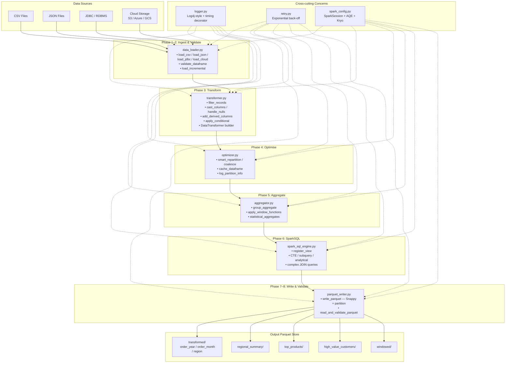
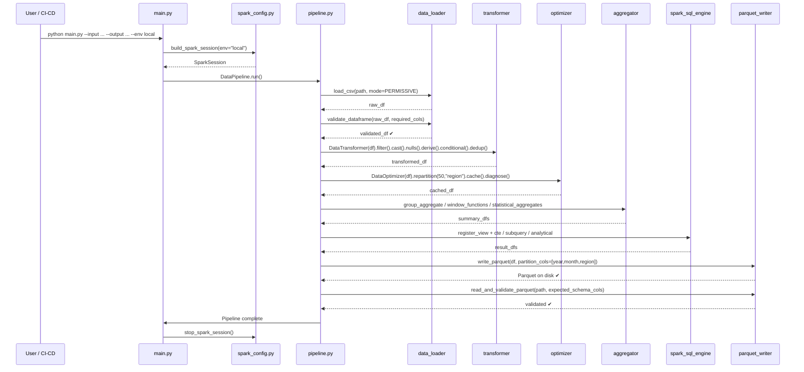

# System Architecture — Distributed Data Processing Pipeline

## Overview

This system is a modular, layered PySpark pipeline with nine execution phases. Each layer has a single responsibility and can be tested, replaced, or scaled independently.

---

## Architecture Diagram



---

## Data Flow Diagram



---

## Module Responsibility Matrix

| Module | Reads | Writes | External I/O |
|---|---|---|---|
| `spark_config.py` | — | SparkSession config | None |
| `data_loader.py` | Raw files (CSV/JSON/JDBC/Cloud) | DataFrame | File system / JDBC / Object store |
| `transformer.py` | DataFrame | DataFrame | None |
| `aggregator.py` | DataFrame | DataFrame | None |
| `spark_sql_engine.py` | DataFrame | DataFrame | Spark Catalog |
| `optimizer.py` | DataFrame | DataFrame | None |
| `parquet_writer.py` | DataFrame | Parquet files | File system / Object store |
| `pipeline.py` | All modules | Pipeline result | Logs |
| `logger.py` | — | Log statements | stdout |
| `retry.py` | — | — | None |

---

## Partitioning Strategy

```
data/output/transformed/
  └── order_year=2022/
        └── order_month=1/
              └── region=NORTH/
                    └── part-00000.snappy.parquet
```

### Why this layout?

| Benefit | Mechanism |
|---|---|
| **Partition pruning** | Queries filtering on `order_year`, `order_month`, or `region` skip irrelevant directories entirely |
| **Predicate pushdown** | Parquet's row-group statistics allow skipping blocks within a file |
| **Dynamic overwrite** | Only partitions present in the new data are replaced — historical partitions untouched |
| **Columnar compression** | Snappy gives ~2–3× compression ratio with low CPU overhead |

---

## Cluster Deployment Modes

| Mode | Master URL | Use Case |
|---|---|---|
| Local (dev) | `local[*]` | Development on a single machine |
| Standalone | `spark://host:7077` | Small dedicated Spark cluster |
| YARN | `yarn` | Hadoop ecosystem (EMR, HDInsight) |
| Kubernetes | `k8s://https://...` | Cloud-native container orchestration |

All modes are parameterised via the `--env` flag in `main.py` and the `MASTER` env-var in `deploy/submit_job.sh`.
